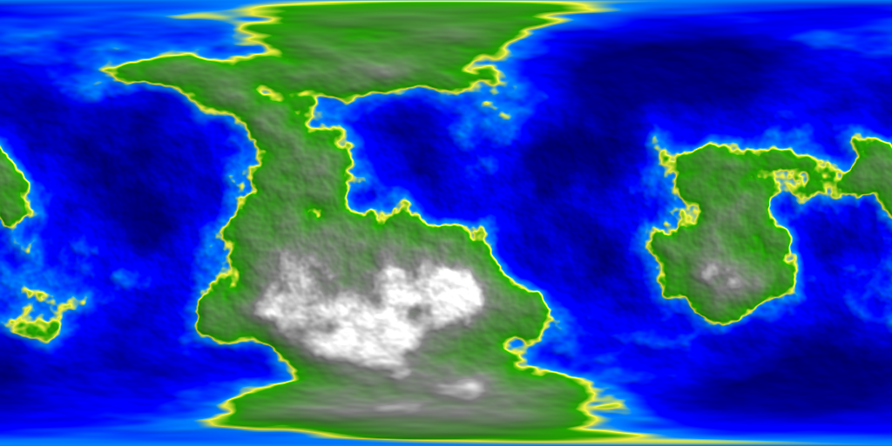

# Libnoise Example

[![Software License][ico-license]](LICENSE.md)

This is a simple example using [libnoise][link-libnoise] and [noiseutils][link-noiseutils] for generating procedural planetary surfaces.

## Install

``` bash
sudo apt-get install cmake
sudo apt-get install build-essential
```

## Compile

``` bash
cd build
cmake ..
make
```

## Usage

``` bash
./noise simple 123
```

## Result

### The Surface Texture



### The Normal Map


### The Specular Map


## License

The GNU Lesser General Public License v3.0 (GNU LGPL v3.0). Please see [License File](LICENSE.md) for more information.

[ico-license]: https://img.shields.io/badge/license-GNU%20LGPL%20v3.0-brightgreen.svg?style=flat-square

[link-libnoise]: http://libnoise.sourceforge.net/
[link-noiseutils]: http://libnoise.sourceforge.net/downloads/noiseutils.zip
